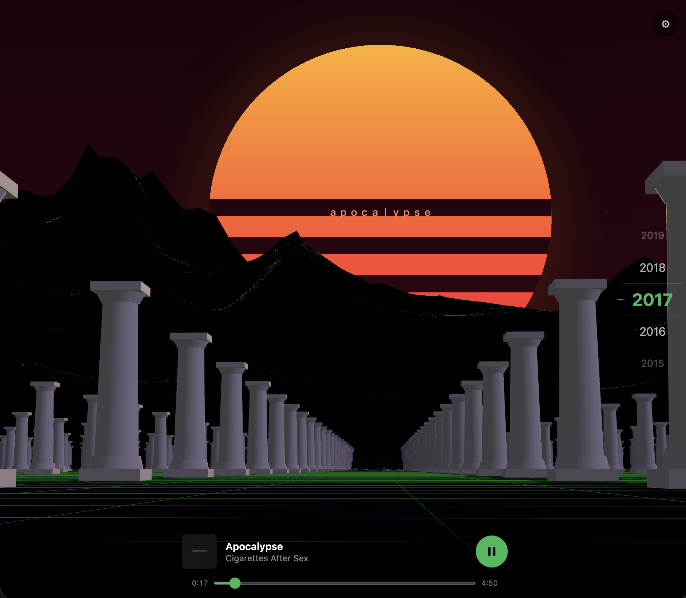
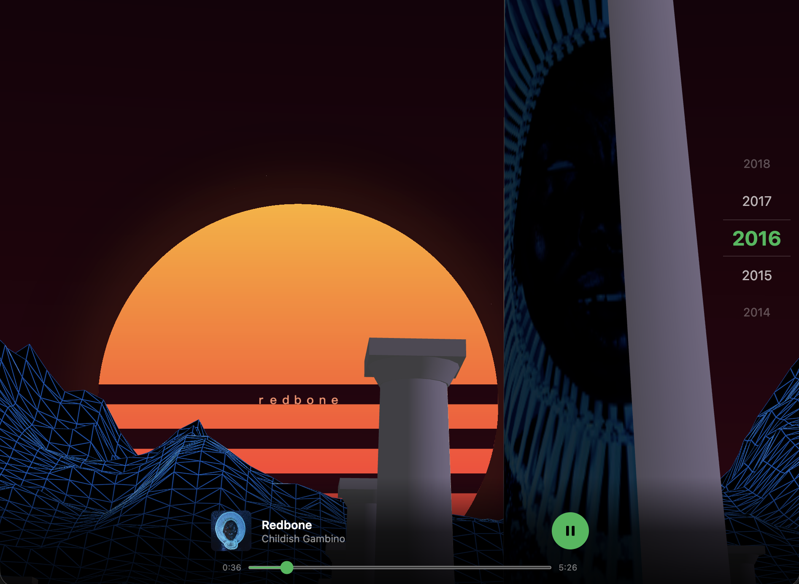

# Bopify

A 3D browser app for browsing your Spotify library.


Built with Vite, React, and [react-three-fiber](https://docs.pmnd.rs/react-three-fiber).
Authentication uses Spotify's Authorization Code flow with PKCE and runs entirely in the
browser, so there's no backend or server to run. It's a static site.

Playback requires a Spotify Premium account. The Web Playback SDK does not stream audio
for free accounts.

|  |  |
| --- | --- |
|  |  |

## Quick start

Requires [Node.js](https://nodejs.org) 18+ and a Spotify app (see below).

```bash
# 1. clone and install
git clone https://github.com/jacobmimms/bopify.git
cd bopify
npm install

# 2. add your Spotify Client ID
cp .env.example .env.local
#   then open .env.local and paste in your Client ID

# 3. run it
npm run dev
```

Open http://127.0.0.1:3000 and log in with Spotify.

Use `127.0.0.1`, not `localhost`. Spotify rejects `http://localhost` as a redirect URI;
it only accepts loopback IP literals such as `http://127.0.0.1` or `http://[::1]` for
local HTTP. The page loads at either address, but the login redirect fails at
`localhost`. See [Spotify's redirect URI docs](https://developer.spotify.com/documentation/web-api/concepts/redirect_uri).

### Creating a Spotify app

1. Go to the [Spotify Developer Dashboard](https://developer.spotify.com/dashboard)
   and click **Create app**.
2. Under **Redirect URIs**, add the app's URL with `/callback` appended. For local dev:
   ```
   http://127.0.0.1:3000/callback
   ```
   If you deploy it, add that URL too, e.g. `https://yourdomain.com/callback`.
3. Under **APIs used**, check **Web Playback SDK**.
4. Save, then copy the **Client ID** into your `.env.local`.

The Client ID is public. PKCE has no client secret, so there's nothing to hide. Each
person who runs Bopify uses their own Spotify app and login.

## Controls

| Input         | Action          |
| ------------- | --------------- |
| `W` `A` `S` `D` | Move          |
| Arrow keys    | Look around     |
| Left stick    | Move (touch)    |
| Right stick   | Look (touch)    |

A year scrubber on the right shows your position in time as you move down the avenue.
Settings menu has show/hide toggles for the compass, now-playing bar and year
picker, toggle for drag inversion, and genre filter.

## How it works

```
src/
  auth/spotify-auth.js     PKCE login, token storage and refresh
  lib/
    spotify-api.js         Web API calls (search + playback)
    color.js               album-art dominant-colour extraction
    textures.js            album-art texture loading/caching
    genres.js              genre filters for the search query
  hooks/useSpotifyPlayer   Web Playback SDK lifecycle
  scene/
    cameraController.js    shared movement state (no React re-renders)
    World.jsx              grid, tile detection, track assignment by year
    Room.jsx               recolours the floor grid to the album's palette
    AlbumColumn.jsx        a column shaft textured with album art
    InstancedColumns.jsx   the colonnade (instanced for performance)
    Bust.jsx               scattered marble busts
    Sky.jsx                sun and sky
    GridFloor.jsx          ground grid
  components/              Login, Callback, Experience, PlaybackBar, HUD
```

Each year along the avenue is populated by querying the Spotify Search API for tracks
from that year, optionally narrowed by a genre filter. The mapping is deterministic: the
same year and genre always produce the same layout. Walking into a column triggers
playback through the Web Playback SDK, applies its album art to the nearby column shafts,
and recolours the floor grid to the art's dominant colour.

## Build and deploy

`npm run build` outputs a static site to `dist/`, which can be hosted anywhere that
serves static files. The `npm run deploy` script targets Cloudflare Pages
(`wrangler pages deploy dist`); replace it for a different host.

```bash
npm run build      # outputs dist/
npm run preview    # serve the production build locally
```

Whatever URL you deploy to, add `https://<that-url>/callback` to your Spotify app's
Redirect URIs.

## License

[MIT](LICENSE). Third-party asset credits, including the
[Poly Haven marble bust](https://polyhaven.com/a/marble_bust_01), are in
[CREDITS.md](CREDITS.md).
